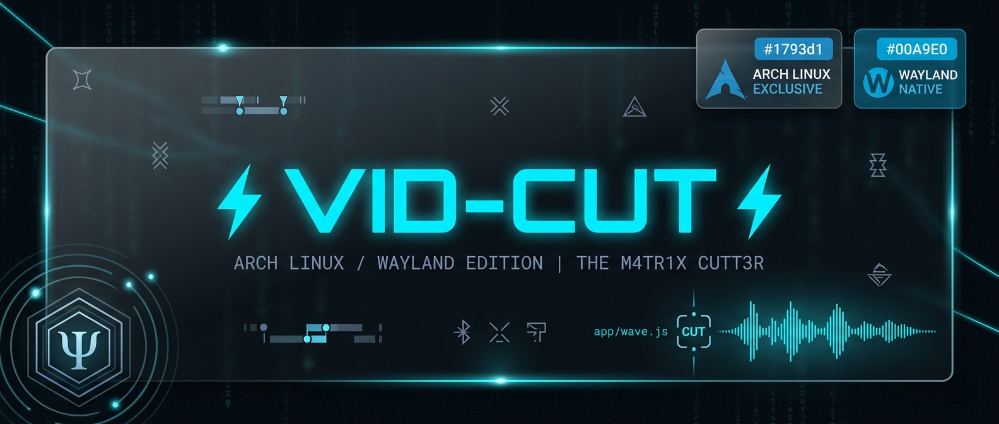

<div align="center">
       ─── ⊰ 💀 • - ⦑ VID-CUT // 4NDR0666OS ⦒ - • 💀 ⊱ ───
</div>

<div align="center">
  <a href="https://github.com/4ndr0666/vidcut" target="_blank">
    
  </a>
</div>

**vidcut** is a lossless video toolkit: cut clips, merge files, extract audio, capture frames, convert segments and record your screen — built on a proven minimal core.

Cuts are **lossless by default**: the segment is stream-copied into a new container with no re-encoding (instant, no quality loss). If the source cannot be stream-copied, vidcut automatically falls back to a fast compatibility re-encode and tells you which mode it used. Sources the player cannot decode at all (AVI, exotic codecs…) fall back to a **live transcode stream** so you can still preview and mark them before cutting.

---

## 📖 TABLE OF CONTENTS

1. [Requirements & Dependencies](#1-requirements--dependencies)
2. [Installation & Setup](#2-installation--setup)
3. [Packaging & System Integration (Arch / Hyprland)](#3-packaging--system-integration-arch--hyprland)
4. [Usage & Keybind Guide](#4-usage--keybind-guide)
5. [Architecture & Module Map](#5-architecture--module-map)
6. [The UI Directive: 3LECTRIC_GLASS_SPEC](#6-the-ui-directive-3lectric_glass_spec)
7. [Golden Reference: Superset Protocol](#7-golden-reference-superset-protocol)
8. [Troubleshooting & FAQ](#8-troubleshooting--faq)
9. [Development & Testing](#9-development--testing)
10. [License](#10-license)

---

## 1. REQUIREMENTS & DEPENDENCIES

* Linux (or Windows), a display, and Node.js 22 (see `.nvmrc`).
* `ffmpeg` is bundled in `app/bin` — nothing else to install.
* Wayland required for native screen recording (`wf-recorder`) under `wlroots`-compatible compositors (Hyprland, Sway).

### System Packages (Arch Linux)
While core binary dependencies are bundled in `app/bin`, system packages ensure full compatibility with external capture tools:

```bash
sudo pacman -S ffmpeg mediainfo nodejs npm wf-recorder slurp
yay -S libxcrypt-compat nvm

```

---

## 2. INSTALLATION & SETUP

### Standard Setup

```bash
# Clone the repository
git clone https://github.com/4ndr0666/vidcut.git
cd vidcut

# Ensure correct Node version is active
nvm install
nvm use

# Install dependencies
npm install

# Launch application
npm start

```

---

## 3. PACKAGING & SYSTEM INTEGRATION (ARCH / HYPRLAND)

To run vidcut as a standalone native desktop application without an active terminal, compile the standalone binary folder with Electron Forge:

### 1. Build Standalone Linux Package

```bash
npm run package

```

*This compiles the application directly into `out/vidcut-linux-x64/vidcut` without requiring Debian packaging utilities (`dpkg`/`fakeroot`).*

### 2. Symlink to User Path

Symlink the binary into your local user path:

```bash
ln -sf /home/git/clone/$USER/vidcut/out/vidcut-linux-x64/vidcut ~/.local/bin/vidcut

```

### 3. Window Manager Keybinding (Hyprland / Lua)

Bind the binary directly in your window manager configuration:

```lua
-- Example for Lua-configured window managers:
local lbin = os.getenv("HOME") .. "/.local/bin"

hl.bind(
    mainMod .. " + F6",
    hl.dsp.exec_cmd(lbin .. "/vidcut"),
    { description = "Vidcut Lossless Video Toolkit" }
)
```

*Or in standard `hyprland.conf`:*

```ini
hl.bind(mainMod .. " + F6", hl.dsp.exec_cmd(lbin .. "/vidcut"), { description = "Vidcut Lossless Video Toolkit" })

```

---

## 4. USAGE & KEYBIND GUIDE

| Action | How |
| --- | --- |
| Open a video | Drag & drop anywhere in the window, **Open video…**, or `Ctrl+O`<br> |
| Play / pause | Click the video, or `Space` — hardcoded, it always toggles playback and never re-triggers a focused button (not even Open right after a load)

 |
| Seek / frame-step | Click or drag the timeline; `←`/`→` — every discrete press steps **exactly one frame** (frame-by-frame); hold for tactile accelerated scrubbing (0.1 s → 0.5 s → 1 s → 2 s → 5 s steps; `Shift` pins 0.05 s while held); the scrub HUD lingers 3.5 s after release so you can keep tapping

 |
| Instant jumps | `Home`/`End` = video start/end; `1`–`9` jump to chapter starts when the container has them (`1` is always the video start); `0` is always the video end — chapters or not. Chapter starts appear as thin cyan ticks on the timeline

 |
| Jump to clip bounds | `Shift+Home` / `Shift+End`, or the chevron buttons flanking the timecode fields

 |
| Zoom & pan | Mouse wheel over the video, or `=` / `−` (1×–6×, ×1.25 per notch). Once zoomed, **Ctrl+drag** slides the picture around — clamped so it can never leave the frame, and a pan never doubles as a play toggle. `Ctrl+0` resets zoom and pan; a new file resets both

 |
| Mark clip start | `I`, or **Start** — or type a timecode into the start field

 |
| Mark clip end | `O`, or **End** — or type a timecode into the end field

 |
| Adjust clip bounds | Drag the green/orange flags on the timeline (hand cursor)

 |
| Undo / redo | `Ctrl+Z` walks clip-mark changes back — keyed marks, flag drags, typed timecodes (a typing burst collapses into one step); `Ctrl+Shift+Z` / `Ctrl+Y` re-applies. Seeks, zoom, rate and mute are navigation, not history; a new file starts a fresh history

 |
| Speed | `[` / `]` (0.2×–2.0×); `Backspace` or a click on the rate chip resets to 1.0×

 |
| Mute | `U`, or the **Mute** toggle — while it is on, what you hear is what you get: the preview plays silent and **Cut / Convert / Merge write silent video**. Extract Audio is exempt (it IS the audio), and audio-only sources keep their audio regardless

 |
| Cut (lossless) | `Enter`, or **Cut** → choose where to save; `Escape` cancels a running job

 |
| Capture a frame | `S`, or **Capture** → saved straight into `~/Pictures/screenshots/` as a JPG — no dialog, idempotent naming

 |
| Extract audio | `A`, or **Extract Audio** → saves the clip's audio as MP3 (VBR best)

 |
| Convert clip | `C`, or **Convert** → re-encodes the clip as a compatibility MP4

 |
| Merge files | `M`, or **Merge…** → pick 2+ files → **Merge**. Inputs that already agree on codec, resolution, fps, pixel format, SAR and audio shape concat **losslessly in one pass**; anything mismatched is normalized first (shared max canvas with letterboxing, one fps, `yuv420p`, aac/48k/stereo — silent sources get audio injected so the join is well-formed, and a conformant video stream is still stream-copied with only its audio re-encoded). One bad file is skipped and reported, never fatal to the batch; every artifact is moov-validated and published atomically, so a failed or cancelled merge never leaves a half-written file on your chosen name

 |
| Merge work dir | The merge sheet's **Change…** row chooses where preprocessing (normalizing mismatched inputs) writes its temporary parts — default is a hidden folder beside the merged output, and the row shows the dir's live free space. When the inputs are big and that disk is not, point it at a roomier one; a disk preflight refuses a work dir that plainly cannot hold roughly the total size of the inputs *before* an hour of encoding is spent on a doomed run. The final output is always published beside its chosen location regardless

 |
| Record screen | `R`, or **Record…** → Start (Wayland, via wf-recorder); the window hides to a blinking tray, click the tray to get it back

 |
| Show last output | `F`, or **Show in folder** — reveals the most recent output in your file manager

 |
| All shortcuts | `?`, or **Help** → the in-app keyboard sheet (the repo link lives inside it)

 |
| Fullscreen | Double-click the video

 |
| Close a panel | `Escape` — in a sheet it closes the sheet; while a job runs it cancels the job. Inside a sheet, `Enter` runs the sheet's primary action and the global tools stay suspended

 |

Every control in the window answers to a key — and says so: buttons carry their keybind in their label or tooltip, and the `?` sheet lists the whole map.

Timecode fields accept `SS.mmm`, `MM:SS.mmm` or `HH:MM:SS.mmm`; `Enter` jumps the playhead there.

Saving never nags: the suggested name is idempotent (a free name is offered as-is) and ascending — if `clip [cut].mp4` already exists, the dialog offers `clip [cut] 2.mp4`, then `3`, `4`… and a suggested name that already carries a counter continues from it. The save dialog also remembers the last folder you saved into (persisted across restarts) and defaults there instead of the source's folder. Screen recordings follow the same convention — an existing `box-….mp4` is never overwritten; the recording lands on `box-… 2.mp4` instead. Frame captures skip the dialog altogether: they write straight into `~/Pictures/screenshots/` as `name [capture].jpg` (then ` 2`, ` 3`…), so taking a screenshot is a single keystroke.

The output keeps the first video and first audio track of the source, and its container matches the source's extension — that is what keeps the default cut lossless. A fresh load always selects the full duration, so **Cut** with untouched marks copies the whole file. With the MUTE toggle on, the audio map is dropped instead (`-an`), so cuts stay just as lossless — only silent.

Every writer is **atomic and validated**: work lands in a hidden `name.vidcut.ext` working file beside the destination and is renamed onto your chosen name only after it passes structural validation (MP4 moov walk, JPEG SOI/EOI markers, a duration floor — a stream copy legitimately starts at the keyframe before your mark, so its length is checked one-sidedly). A cancelled, failed or corrupt write therefore never leaves a partial file squatting on a name the idempotent naming would treat as occupied. Cuts also carry `-fflags +genpts` on the copy attempt — the same timestamp insurance your ffx applies to its remuxes; on well-formed sources the output is byte-identical, on sources with missing PTS it turns a doomed stream copy into a clean lossless one instead of a lossy re-encode.

> Stream copy starts at the keyframe nearest your start mark, so a lossless clip can begin slightly earlier than the exact frame you marked. That is the trade-off for instant, quality-free cutting; the automatic re-encode fallback covers sources where copy is impossible.
> 
> 

---

## 5. ARCHITECTURE & MODULE MAP

| File | Role |
| --- | --- |
| `app/main.js` | Window lifecycle, native dialogs, tray, IPC surface, quit orchestration

 |
| `app/ffmpeg.js` | The one job slot: cut / convert / extract / capture / merge (probe → lossless fast path with validation, or the normalize path with per-file intermediates in the configurable work dir behind a disk preflight) + metadata probe, progress, cancel — every writer atomic (`.vidcut` working file + validated rename)

 |
| `app/recorder.js` | wf-recorder supervision (spawned and owned by main — SIGINT finalize, SIGKILL escalation)

 |
| `app/server.js` | Local streaming-transcode server for sources the player cannot decode

 |
| `app/renderer.js` | Core UI: drag & drop, player, timeline, clip marking, tools, speed, mute toggle, chapter ticks, sheets manager

 |
| `app/merge.js`, `app/record.js` | The merge and record sheets (hidden in markup; only explicit user action reveals them)

 |
| `app/wave.js` | Audio-only waveform visualizer (lazily attached, DPR-aware)

 |
| `app/index.html` + `app/main.css` | The 3LECTRIC_GLASS layout

 |

### Security Posture & IPC Isolation

Security posture is unchanged and deliberate: `nodeIntegration: true`, `contextIsolation: false` — a local-only, offline application. Untrusted strings (file names, ffmpeg output) are rendered exclusively via `textContent`, and every OS-level action (dialogs, jobs, recording, help) goes through IPC to the main process. The main process owns every child: jobs are killed on quit, the recorder gets a SIGINT grace to finalize its container, and the stream server's sockets are destroyed.

### Layout Invariants

Layout invariants worth knowing if you restyle: `#stage` is the only flexible area, the `<video>` is absolutely positioned with `object-fit: contain` (it can never push the toolbar or force a window resize), control rows wrap instead of overflowing, modal sheets are `hidden` in markup and can never render on init, and the window is floored at 520×480 so the full control stack always fits. Every toolbar glyph is an inline stroked SVG (`.icon-svg`, `stroke: currentColor`) — never a unicode media symbol, because emoji-presentation codepoints render through the system color-emoji font and ignore CSS color, which is how off-spec yellow icons creep into a HUD. The chrome is symmetric by construction: brand / filename / Open in the top bar, mirrored nav clusters flanking the segment inputs, the selection readout centered between them and Cut, and the speed segment joined into one pill.

---

## 6. THE UI DIRECTIVE: 3LECTRIC_GLASS_SPEC

All interface additions must adhere strictly to the **3LECTRIC_GLASS_SPEC**.

```css
:root {
  --bg-dark-base: #050A0F;
  --bg-glass-panel: rgba(10, 19, 26, 0.25);
  --accent-cyan: #00E5FF;
  --text-cyan-active: #67E8F9;
  --text-secondary: #8892B0;
  --accent-cyan-border-idle: rgba(0, 229, 255, 0.2);
  --accent-cyan-border-hover: rgba(0, 229, 255, 0.5);
  --accent-cyan-bg-hover: rgba(0, 229, 255, 0.05);
  --accent-cyan-bg-active: rgba(0, 229, 255, 0.2);
  --glow-cyan-active: rgba(0, 229, 255, 0.6);
  --font-body: 'Roboto Mono', monospace;
  --font-display: 'Orbitron', sans-serif;
}

```

* **Panels:** Must use `--bg-glass-panel` combined with `backdrop-filter: blur(12px)`.


* **Buttons (`.hud-button`):** Transparent borders on idle, glowing cyan borders on hover (`--accent-cyan-border-hover`), deep cyan background with box-shadow glow on active.


* **Dropzone:** The center `Ψ` (Psi) glyph is an inline SVG linked to CSS stroke variables, never a rasterized bitmap.


---

## 7. GOLDEN REFERENCE: SUPERSET PROTOCOL

This repository enforces the **Superset Protocol**. Any revision or refactoring must maintain full backward compatibility and must never regress or drop existing functional logic.

### Audit Verification Checklist

1. **Segment Validation:** Logic updates must be verified against prior stable feature blocks.


2. **Diff Validation:** Ensure git diffs strictly represent enhancements, fixes, or optimizations.


3. **Zero Omission Policy:** Dropping known edge-case fixes, bounds checks (such as playback rate thresholds), or error guards is classified as an immediate build failure.


---

## 8. TROUBLESHOOTING & FAQ

**Q: Screen recording fails to start or creates a 0-byte file.**

* **A:** Verify you are running an active Wayland session (`echo $WAYLAND_DISPLAY`). Ensure `wf-recorder` is installed. If running under a non-wlroots compositor (e.g. GNOME/Mutter), `wf-recorder` may fail without custom portal overrides.


**Q: Video playback stutters heavily or CPU usage spikes.**

* **A:** For exotic formats not natively supported by the HTML5 video element, Vid-Cut spins up a local stream server (`app/server.js`) to live-transcode via FFmpeg. This is CPU-intensive. Where possible, source files encoded in standard H.264/AAC provide the smoothest performance.


**Q: Cut videos have frozen frames at the start.**

* **A:** This happens when cutting highly compressed inter-frame codecs without an immediate keyframe. Vid-Cut mitigates this with `-accurate_seek`, `-avoid_negative_ts 1`, and `-fflags +genpts`. If an exact frame is required, run **Convert** instead of **Cut** to transcode the boundary frames.


**Q: Segfaults when reading MPEG-TS (`.ts`) files.**

* **A:** The bundled ffmpeg 4.3.1 static build segfaults reading MPEG-TS (`.ts`) files. Replace `app/bin/ffmpeg` with a current system build if you need `.ts` sources; everything else (.mp4/.mkv/.avi/.webm/…) is handled fine.


---

## 9. DEVELOPMENT & TESTING

* `npm test` — offline pipeline tests: cut / convert / extract / capture / merge / probe (real fixtures, real ffmpeg)


* `node scripts/test-server.js` — offline streaming-server tests


* `node scripts/superset-inventory.js` — feature superset check: every capability shipped from v2.0.0 on must still be present and wired


* `xvfb-run -a -s "-screen 0 1920x1080x24" npm run smoke` — boots the real app headlessly and drives it through its real IPC surface (layout invariants, sheets-hidden-at-boot, stream fallback, recorder ENOENT path, five window sizes)


---

## 10. LICENSE

SEE LICENSE.
